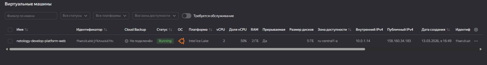
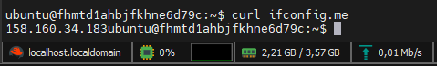
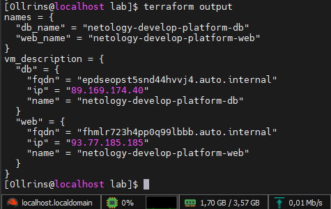

# Домашнее задание к занятию «Основы Terraform. Yandex Cloud»

## Задание 1

  
   
  <em>скриншот ЛК Yandex Cloud с созданной ВМ, где видно внешний ip-адрес </em>

  
   
  <em>скриншот консоли, curl должен отобразить тот же внешний ip-адрес </em>

### 1.4 Cинтаксические ошибки: 
- Platform "standard-v4" not found - не нашёл такую платформу, standard-v3 использовался + опечатка standart
- "standard-v3"; allowed core number: 2, 4 - возможное количество ядер, для standard-v3 мин. 2
- "standard-v3"; allowed core fractions: 20, 50, 100 - гарантированная доля vCPU, для standard-v3 мин. 20
- и память 1 GB было, платформа Intel Ice Lake (standard-v3): 0.5 RAM, ГБ на 1 ядро

### 1.6 
В процессе обучения могут пригодиться параметры preemptible = true и core_fraction=5 в параметрах ВМ для экономии облачных ресурсов, если нужно будет оставить машину на длительное время, но она не нужна на постоянной основе и не производит вычислений

## Задание 4

  
   
  <em>вывод значений ip-адресов команды terraform output </em>

